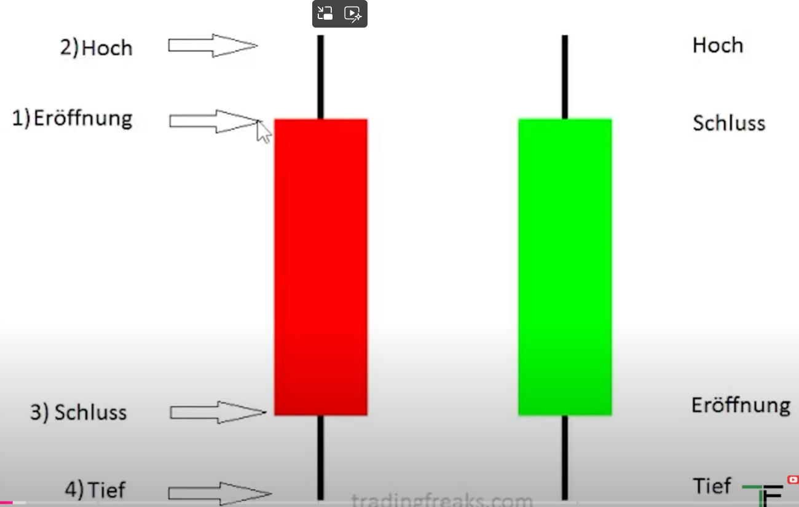
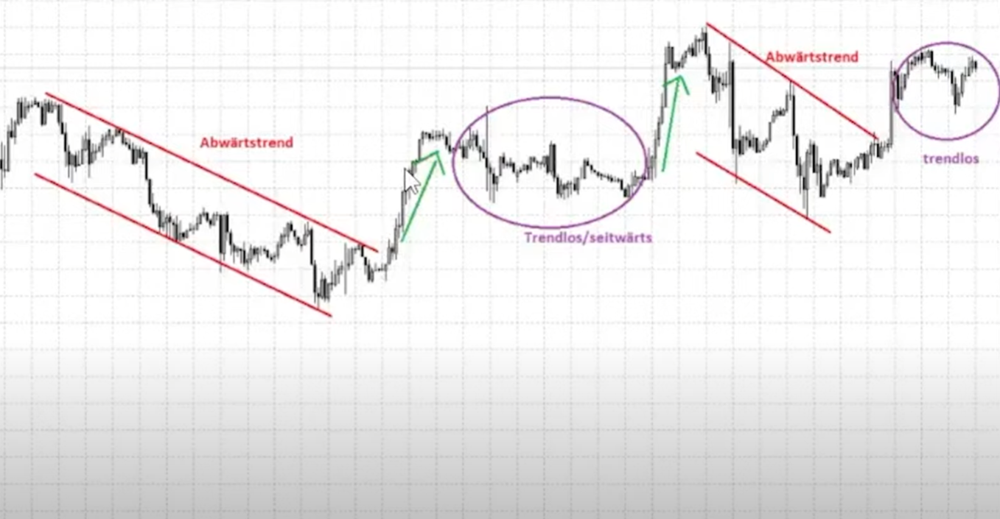
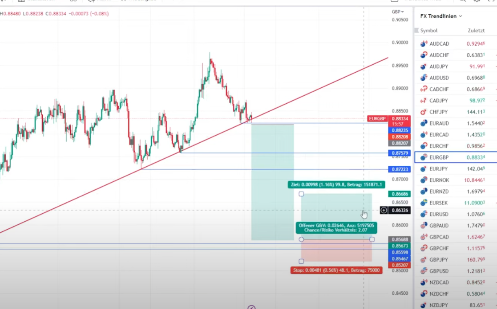
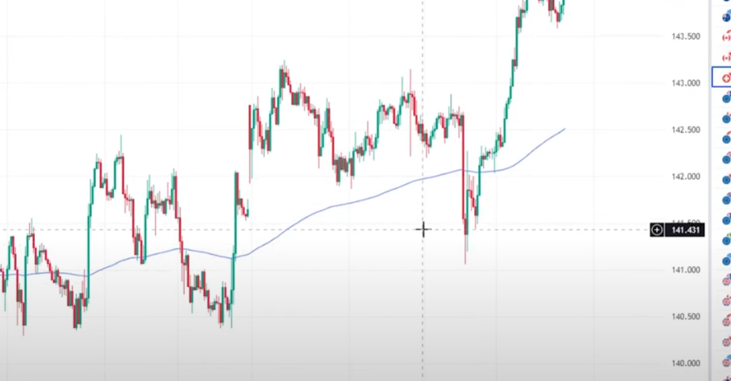
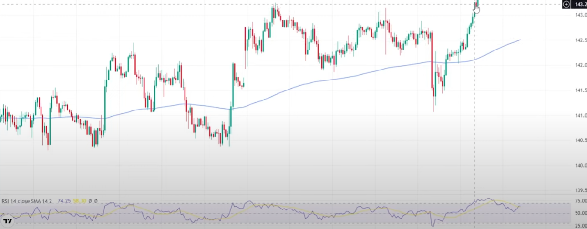
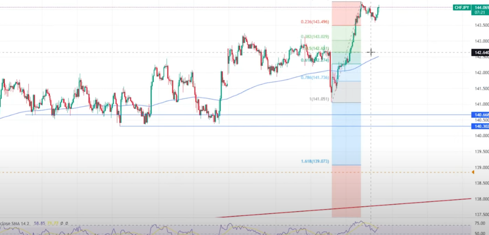

# Chartanalyse #Tutorial_Chartanalytics

**Datum:** 2024-11-08
**Quelle:** Logseq

---

{{youtube https://youtu.be/rwlXNPne0P4}}

## Zusammenfassung

Das YouTube-Video von "TradingFreaks" bietet eine Einführung in die Chartanalyse für Trading-Anfänger. Der Fokus liegt auf grundlegenden Techniken wie der Interpretation von Kerzenformationen, der Identifizierung von Trends und dem Zeichnen von Trendlinien. Der YouTuber zeigt konkrete Beispiele aus dem DAX-Chart und erklärt, wie diese Elemente zur Optimierung von Einstiegen und Ausstiegen bei Trades genutzt werden können. Ausserdem werden verschiedene Indikatoren vorgestellt, wie der Relative Strength Index (RSI) und das Fibonacci Retracement, die beim Treffen von Trading-Entscheidungen helfen können. Das Video ermutigt Zuschauer, die gelernten Techniken zu testen und ein gutes Risikomanagement zu etablieren.

---

## Briefing

**Hauptthemen:**

- **Chartanalyse Grundlagen:** Kerzen, Indikatoren, Trendwenden erkennen
- **Trends erkennen und handeln:** Abwärtstrends, Aufwärtstrends, Trendlinien einzeichnen
- **Unterstützung und Widerstände:** Horizontale Linien, Extrempunkte im Chart
- **Trendwechsel handeln:** Bruch von Trendlinien, Kombination mit Indikatoren
- **Indikatoren:** Gleitende Durchschnitte, RSI, Fibonacci Retracement

Dieser Leitfaden dient der Vertiefung des Verständnisses der Chartanalyse im Trading, insbesondere für Anfänger. Er beinhaltet eine Zusammenfassung der wichtigsten Punkte aus dem Video "Das beste CHARTANALYSE Video für Trading Anfänger | Einfache Anleitung +Tutorial Charttechnik lernen", einen kurzen Quiz zur Überprüfung des Wissens, fünf Essayfragen zur weiteren Auseinandersetzung sowie ein Glossar der wichtigsten Begriffe.

---

## Wichtigste Punkte

**Kerzen:** Jede Kerze repräsentiert eine bestimmte Zeiteinheit und zeigt Eröffnungs-, Schluss-, Hoch- und Tiefstkurse innerhalb dieser Periode.

- Grüne Kerzen: Schlusskurs höher als Eröffnungskurs.
- Rote Kerzen: Schlusskurs niedriger als Eröffnungskurs.

**Trends:**

- Aufwärtstrend: Höhere Hochs und höhere Tiefs.
- Abwärtstrend: Tiefere Tiefs und tiefere Hochs.
- Trendlose Phasen (Seitwärtsmärkte): Keine klare Richtung erkennbar.

**Trendlinien und Trendkanäle:** Visuelle Hilfsmittel zur Trendidentifikation und zum Finden von Ein- und Ausstiegspunkten.

**Unterstützungs- und Widerstandszonen:** Bereiche im Chart, an denen der Kurs in der Vergangenheit gestoppt wurde und sich umkehren könnte.

**Extrempunkte:** Lokale Hoch- und Tiefpunkte im Chart, die als Grundlage für das Einzeichnen von horizontalen Unterstützungs- und Widerstandslinien dienen.

**Rebound/Reverse Trading:** Strategie, die darauf abzielt, an Unterstützungs- und Widerstandszonen von einer Trendumkehr zu profitieren.

**Indikatoren:** Mathematische Berechnungen basierend auf Kursdaten, die zusätzliche Informationen liefern können, z. B. über Trendstärke, Momentum oder Überkauft/Überverkauft-Zustände.

- Gleitender Durchschnitt:

- Relative Stärke (RSI):

- Fibonacci Retracement:

**Trading Strategie:** Ein definierter Plan mit Regeln für Ein- und Ausstiege, Risikomanagement und Positionsgröße.

**Backtesting:** Überprüfung einer Strategie anhand historischer Daten, um die Wahrscheinlichkeit ihres Erfolgs einzuschätzen.

**Risikomanagement:** Der Prozess der Identifizierung, Bewertung und Kontrolle von Risiken, um potenzielle Verluste zu minimieren.

**Positionsgröße:** Der Geldbetrag, der in einem Trade riskiert wird, angepasst an das Trading-Kapital und die Risikobereitschaft.

---

## Quiz

**Was zeigt eine einzelne Kerze in einem Chart?**

Eine Kerze repräsentiert eine bestimmte Zeiteinheit und visualisiert den Eröffnungs-, Schluss-, Hoch- und Tiefstpreis innerhalb dieser Periode. Die Farbe der Kerze zeigt an, ob der Schlusskurs höher (grün) oder niedriger (rot) als der Eröffnungskurs war.

**Was kennzeichnet einen Abwärtstrend?**

Ein Abwärtstrend ist durch sukzessive tiefere Tiefs und tiefere Hochs gekennzeichnet. Der Kurs bewegt sich also in einer absteigenden Richtung.

**Nennen Sie zwei Arten von Trendlinien und beschreiben Sie ihren Zweck.**

Trendlinien verbinden Hoch- oder Tiefpunkte im Chart und visualisieren die Richtung des Trends. Trendkanäle bestehen aus zwei parallelen Trendlinien, die den Bereich begrenzen, in dem sich der Kurs bewegt. Sie dienen der Identifizierung von Trends und potenziellen Ein- und Ausstiegsleveln.

**Was versteht man unter einer Unterstützung?**

Eine Unterstützung ist eine Zone im Chart, an der der Kurs in der Vergangenheit gestoppt wurde und von der er nach oben abprallen könnte. Sie entsteht durch eine Häufung von Tiefpunkten oder durch eine horizontale Linie, die durch markante Tiefs verläuft.

**Erklären Sie den Begriff "Rebound Trading".**

Rebound Trading ist eine Strategie, die darauf abzielt, an Unterstützungen von einer Trendumkehr nach oben zu profitieren. Man kauft also, wenn der Kurs an eine Unterstützung fällt und erwartet, dass er von dort wieder ansteigt.

**Was ist ein gleitender Durchschnitt und welche Funktion hat er?**

Der gleitende Durchschnitt ist ein Indikator, der den Durchschnittskurs über eine bestimmte Anzahl von Perioden berechnet. Er glättet die Kursbewegungen und kann helfen, Trends zu identifizieren oder Unterstützungs- und Widerstandszonen zu definieren.

**Wie kann der RSI im Trading eingesetzt werden?**

Der RSI ist ein Oszillator, der die Stärke der Kursbewegung misst. Werte über 70 deuten auf einen überkauften Markt hin, Werte unter 30 auf einen überverkauften Markt. Trader nutzen den RSI, um potenzielle Trendwenden oder Kauf-/Verkaufssignale zu identifizieren.

**Beschreiben Sie das Fibonacci Retracement und seine Anwendung.**

Das Fibonacci Retracement basiert auf mathematischen Verhältnissen, die häufig in der Natur und auch in Finanzmärkten vorkommen. Es wird verwendet, um potenzielle Unterstützungs- und Widerstandsniveaus zu finden, an denen der Kurs nach einer starken Bewegung korrigieren könnte.

**Was ist Backtesting und warum ist es wichtig?**

Backtesting ist die Überprüfung einer Trading-Strategie anhand historischer Daten. Es dient dazu, die Wahrscheinlichkeit des Erfolgs der Strategie zu beurteilen und potenzielle Schwächen aufzudecken, bevor man sie mit echtem Geld handelt.

**Welche Faktoren beeinflussen die Wahl der Positionsgröße?**

Die Wahl der Positionsgröße hängt vom Trading-Kapital, der Risikobereitschaft, dem Stop-Loss-Level und dem Chance-Risiko-Verhältnis des Trades ab. Man sollte nur einen kleinen Teil des Kapitals pro Trade riskieren, um große Verluste zu vermeiden.

---

## Essayfragen

### Kerzenmuster in der Chartanalyse

Kerzenmuster, auch Candlestick Patterns genannt, sind ein zentrales Element der technischen Chartanalyse. Sie helfen Analysten und Tradern, Marktbewegungen zu interpretieren und mögliche Trends vorherzusagen.

| Aspekt | Beschreibung |
|---|---|
| **Farbe** | Grüne Kerze = Anstieg (Bullish), rote Kerze = Rückgang (Bearish). |
| **Körper** | Differenz zwischen Eröffnungs- und Schlusskurs. Langer Körper = starke Bewegung. Kurzer Körper = Unentschlossenheit. |
| **Dochte (Schatten)** | Hoch/Tief des Zeitraums. Langer oberer Docht = Verkaufsdruck. Langer unterer Docht = Kaufdruck. |
| **Lange Kerzenkörper** | Starkes Interesse von Käufern (grün) oder Verkäufern (rot). |
| **Kurze Kerzenkörper / Doji** | Unentschlossenheit im Markt. Mögliches Zeichen für Trendwende. |

**Wichtige Muster:**

| Muster | Bedeutung |
|---|---|
| **Hammer** | Bullisches Muster am Ende eines Abwärtstrends — mögliche Umkehr. |
| **Hanging Man** | Bärisches Muster nach Aufwärtstrend — möglicher Trendwechsel nach unten. |
| **Shooting Star** | Bärisches Muster mit langem oberen Docht — Widerstand im Markt. |
| **Doji** | Unentschlossenheit; Trendwendesignal in Kombination mit anderen Mustern. |

Kerzenmuster bieten wertvolle Hinweise über Marktpsychologie, Trendrichtung und Markteintrittspunkte.

---

### Trendlinien vs. horizontale Unterstützungs- und Widerstandslinien

| Kriterium | Trendlinien | Horizontale Linien |
|---|---|---|
| **Definition** | Schräge Linien, die aufeinanderfolgende Hochs oder Tiefs verbinden. | Horizontale Linien bei historischen Stopp-Kursniveaus. |
| **Trendfortsetzung** | Zeigen allgemeine Richtung eines Trends. | Markieren psychologisch wichtige Niveaus (runde Zahlen). |
| **Flexibilität** | Können bei veränderten Trendwinkeln angepasst werden. | Konstant, auch bei veränderten Marktbedingungen. |
| **Subjektivität** | Können subjektiv sein (unterschiedliche Punkte). | Objektiver, aber in volatilen Märkten oft durchbrochen. |
| **Seitwärtsmärkte** | Wenig Mehrwert ohne klaren Trend. | Bessere Analysebasis in Seitwärtsphasen. |

Fazit: Trendlinien für Trendmärkte, horizontale Linien für Seitwärtsmärkte — Kombination beider Ansätze empfohlen.

---

### Technische vs. Fundamentale Analyse

| Kriterium | Technische Analyse | Fundamentale Analyse |
|---|---|---|
| **Ziel** | Marktbewegungen aus Preisdaten und Chartmustern. | Innerer Wert basierend auf wirtschaftlichen Faktoren. |
| **Datenbasis** | Preischarts, Volumen, technische Indikatoren (RSI, MACD). | Bilanzen, G+V, Makrodaten, Branchenanalysen. |
| **Zeithorizont** | Kurzfristig (Day-Trading, Swing-Trading). | Langfristig (Buy-and-Hold). |
| **Vorteile** | Klare visuelle Signale, reagiert auf kurzfristige Stimmungen. | Tiefergehende wirtschaftliche Faktoren. |
| **Nachteile** | Ignoriert Fundamentaldaten. | Schwieriges kurzfristiges Timing. |

**Kombination:** Fundamentalanalyse für Asset-Auswahl → Technische Analyse für Entry-Timing.

---

### Psychologie im Trading

| Emotion | Beschreibung | Herausforderung | Bewältigung |
|---|---|---|---|
| **Angst** | Markt bewegt sich gegen Position. | Positionen zu früh schließen. | Stop-Loss, Backtesting. |
| **Gier** | Gewinne maximieren wollen. | Überkaufte Signale ignorieren. | Take-Profit-Niveaus einhalten. |
| **Übermut** | Nach Erfolgen Risiken unterschätzen. | Riskantere Trades, schlechtes Risikomanagement. | Disziplin, Regeln einhalten. |
| **Hoffnung** | Verlustpositionen halten. | Verluste vergrößern. | Stop-Loss konsequent setzen. |
| **Frustration** | Nach Verlusten impulsiv reagieren. | Rache-Trades. | Pausen, emotionale Distanz. |
| **Ungeduld** | Märkte zu langsam, Trades erzwingen. | Voreilige Entscheidungen. | Marktgeduld, strikte Regeln. |

---

### Trading-Strategie: EMA50 + RSI

**Indikatoren:** EMA 50 (mittelfristiger Trend) + RSI 14 (Momentum)

**Long-Einstieg:** Kurs über EMA50 + RSI unter 30 + grüne Bestätigungskerze.

**Long-Ausstieg:** RSI über 70 (Take-Profit) oder Stop-Loss unter letztem Swing-Tief (1–2% unter Einstieg).

**Short-Einstieg:** Kurs unter EMA50 + RSI über 70 + rote Bestätigungskerze.

**Short-Ausstieg:** RSI unter 30 oder Stop-Loss über letztem Swing-Hoch.

**Risikomanagement:** Max. 1–2% des Kapitals pro Trade.

**Positionsgröße-Formel:** Kontogröße × Risikoprozentsatz ÷ Abstand zum Stop-Loss

---

## Glossar

| Begriff | Bedeutung |
|---|---|
| **Kerze** | Grafische Darstellung von Preisbewegungen in einer Zeiteinheit. |
| **Trend** | Allgemeine Richtung der Kursbewegung. |
| **Trendlinie** | Linie, die Hoch- oder Tiefpunkte im Chart verbindet. |
| **Trendkanal** | Zwei parallele Trendlinien, die den Bereich der Kursbewegung begrenzen. |
| **Unterstützung** | Preisniveau, an dem der Kurs tendenziell abprallt. |
| **Widerstand** | Preisniveau, an dem der Kurs tendenziell stoppt. |
| **Extrempunkt** | Lokaler Hoch- oder Tiefpunkt im Chart. |
| **Rebound/Reverse Trading** | Strategie an Unterstützungs- oder Widerstandslinien. |
| **Indikator** | Mathematische Berechnung basierend auf Kursdaten. |
| **Gleitender Durchschnitt** | Durchschnittskurs über N Perioden. |
| **RSI** | Relativer Stärke Index — misst Stärke der Kursbewegung. |
| **Fibonacci Retracement** | Werkzeug für potenzielle Unterstützungs- und Widerstandsniveaus. |
| **Backtesting** | Strategieprüfung anhand historischer Daten. |
| **Risikomanagement** | Identifizierung, Bewertung und Kontrolle von Risiken. |
| **Positionsgröße** | Geldbetrag, der in einem Trade riskiert wird. |

---

*Topics: #chartanalyse #trading #technische-analyse #rsi #fibonacci #Tutorial_Chartanalytics*
