# Philosophie #philosophy

**Datum:** 2024-11-20
**Quelle:** Logseq

---

{{youtube https://youtu.be/C5Dr7wrWh7c}}

## Geschichte der Philosophie

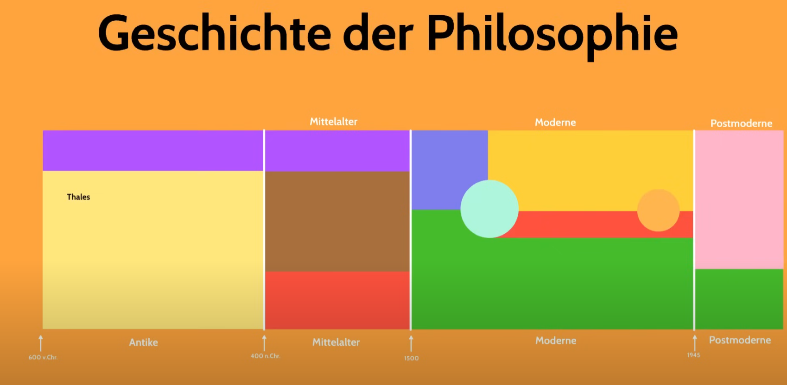

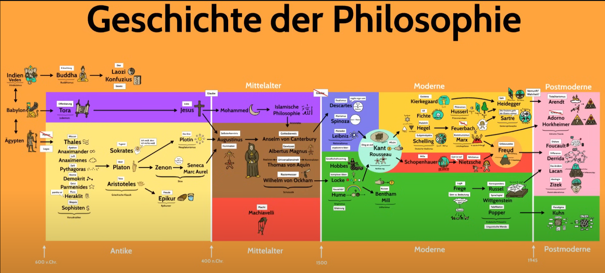

Thales von Milet gilt als erster Philosoph. Du kennst vielleicht den Thaleskreis aus der Mathematik, das ist derselbe Thales.

Schon vor Thales gab es natürlich weise Menschen in Ägypten, Babylon und Indien. Die Veden zum Beispiel sind uralte Schriften in denen auch schon philosophische Gedanken festgehalten sind.

Aus der hinduistischen Philosophie schöpft Buddha und begründet den Buddhismus, der sich in Asien ausbreitet. Erleuchtung ist ein zentraler Begriff Buddhas. Auch in China entstehen philosophische Strömungen, nämlich der Daoismus und der Konfuzianismus.

Aber hier geht es um die Philosophie des Abendlands und deren Geburtsstunde markiert Thales. Thales ersetzt den Mythos durch den Logos.

Vorher wurde die Welt durch Mythen erklärt. Also Göttergeschichten über die Entstehung der Natur und des Menschen. Die gab es überall auf der Welt.

Thales allerdings glaubt nicht an die alten Geschichten. Er folgt dem Logos, also der Vernunft. Kein Wunder, denn er ist auch Mathematiker. Und in der Mathematik kann er selbstständig mit der Vernunft zu Erkenntnissen gelangen. Und mit der Mathematik als Vorbild versucht er nun, die ganze Welt vernünftig und wissenschaftlich zu erklären.

---

## Überblick

### Altertum

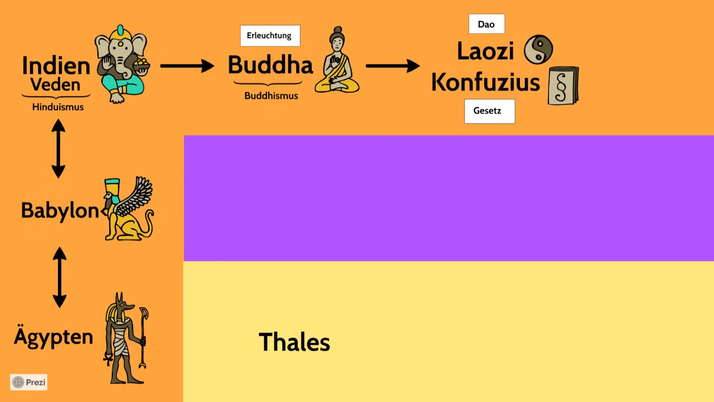

### Antike — Vorsokratiker / Griechische Klassik

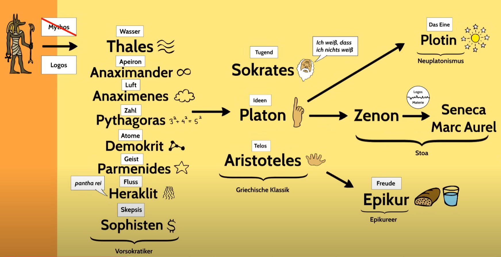

### Christentum

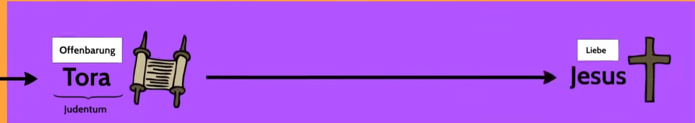

### Mittelalter

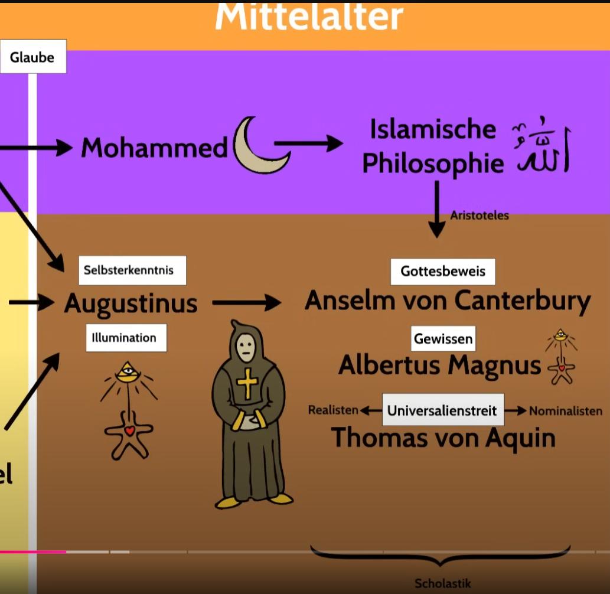

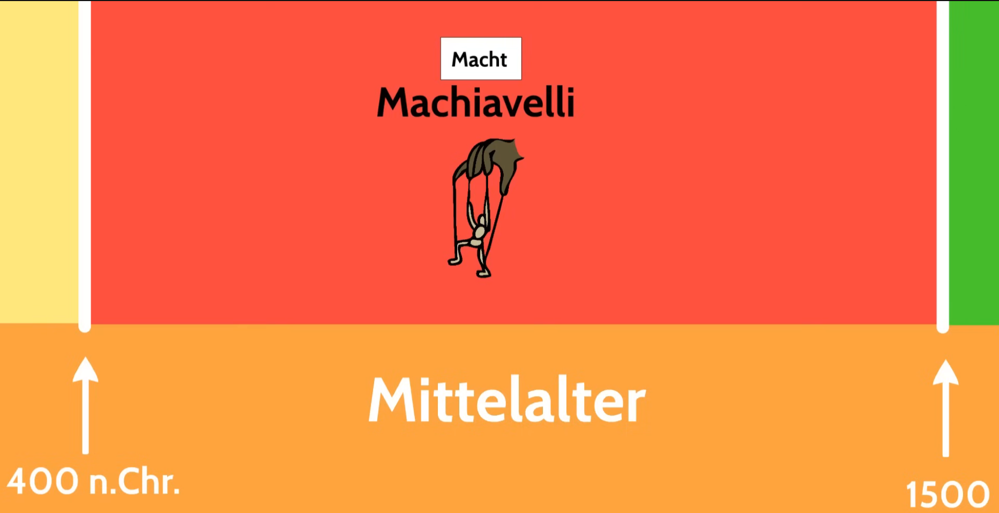

### Moderne

**Rationalismus:**

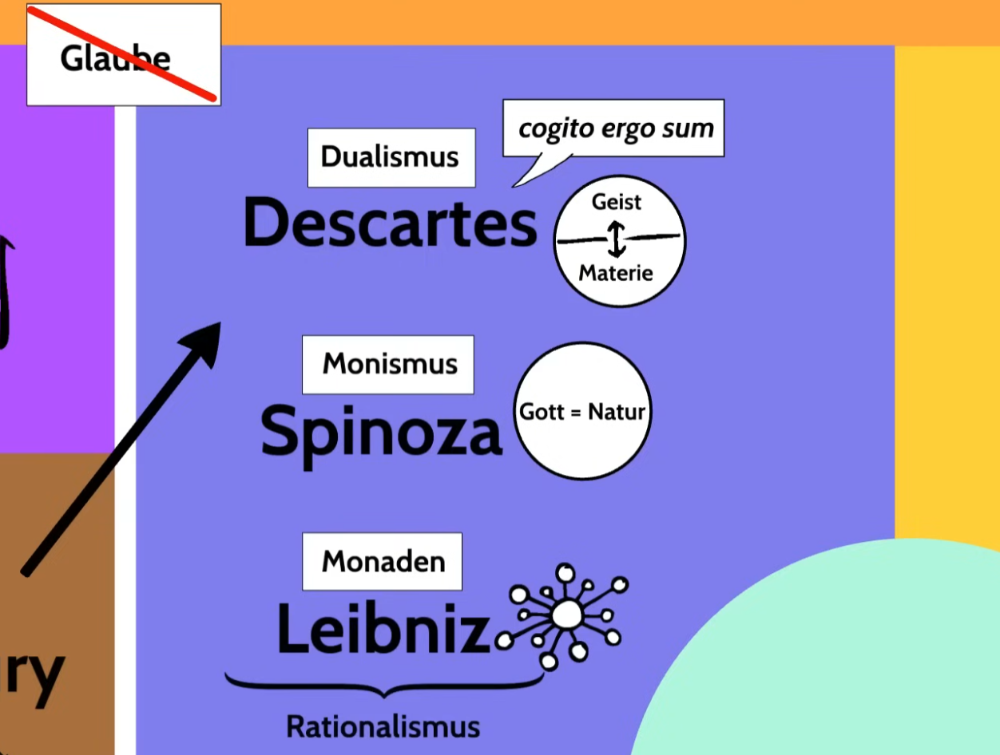

**Empirismus:**

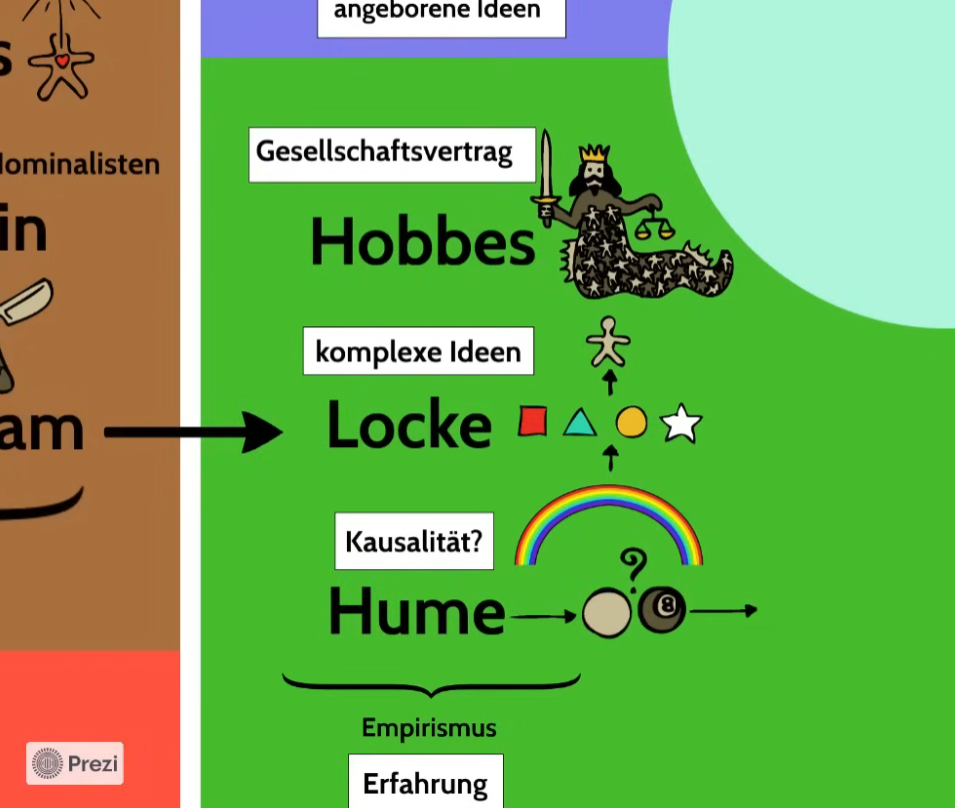

**Aufklärung:**

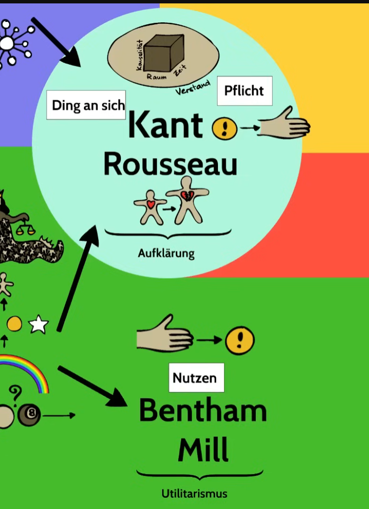

**Deutscher Idealismus:**

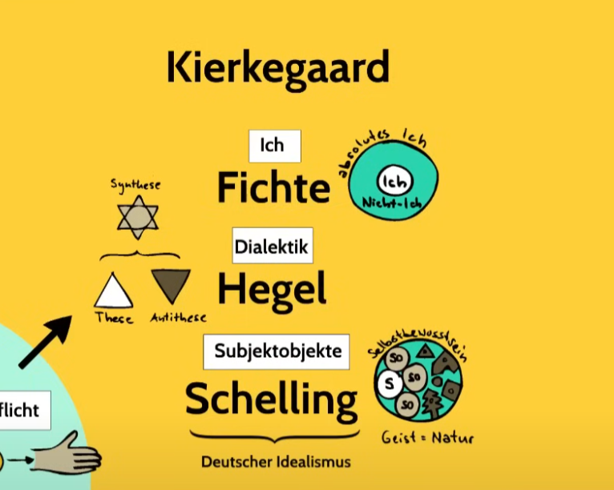

**Linkshegelianer:**

**Phänomenologie:**

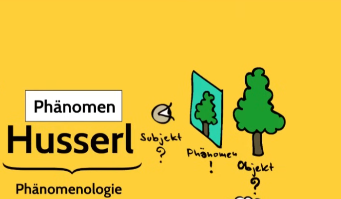

**Existenzphänomenologie:**

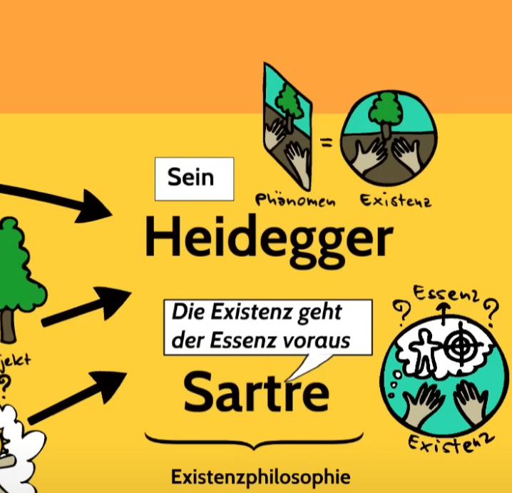

**Analytische Philosophie:**

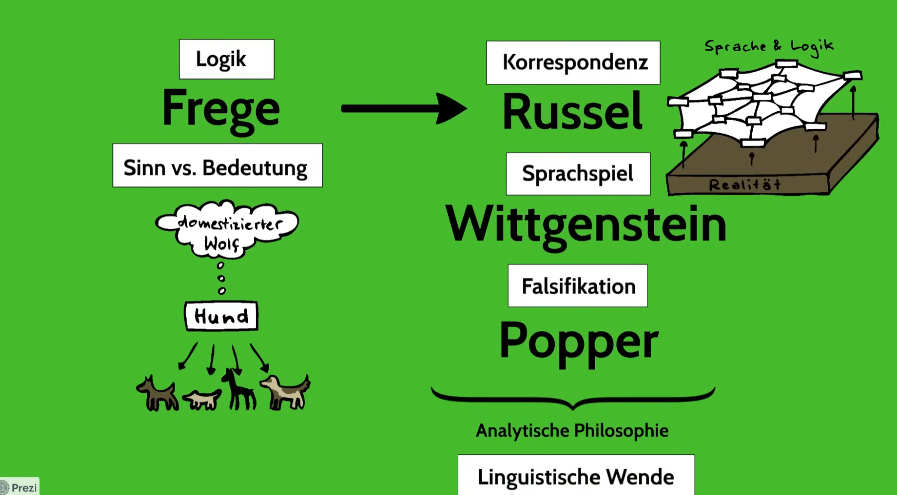

**Psychologie:**

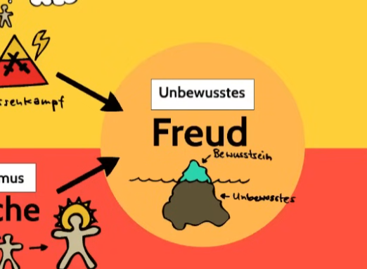

### Post-Moderne

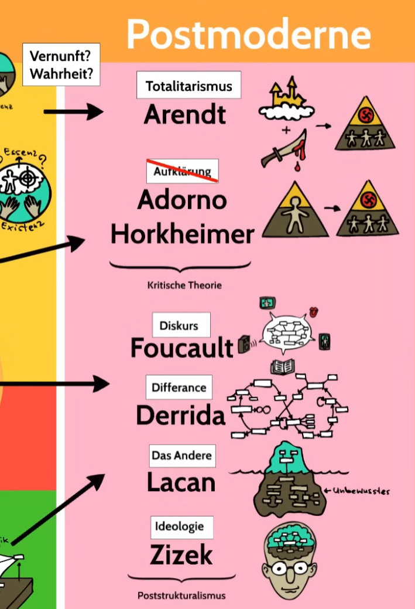

### Summary

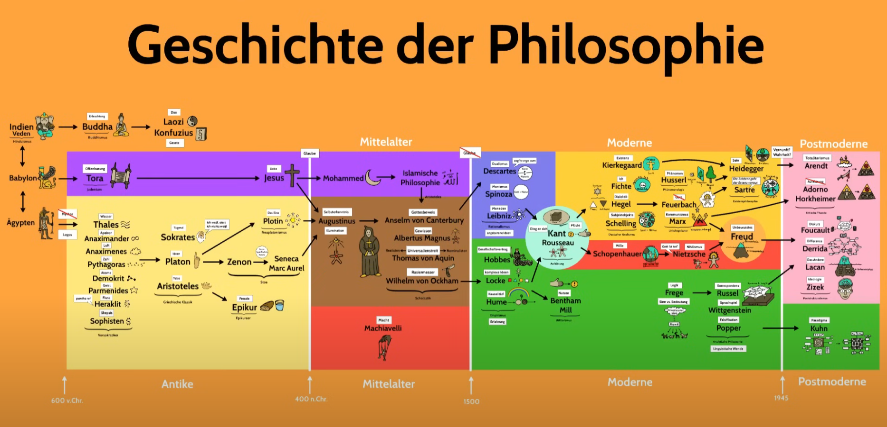

---

## Persönlichkeiten

**Thales · Anaximander · Anaximenes · Pythagoras · Demokrit · Parmenides · Heraklit · Sokrates · Platon · Aristoteles · Plotin · Zenon · Seneca · Marc Aurel · Epikur**

---

*Topics: #philosophie #geschichte #thales #vorsokratiker #antike #philosophy*
