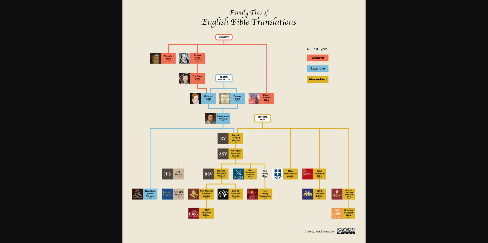
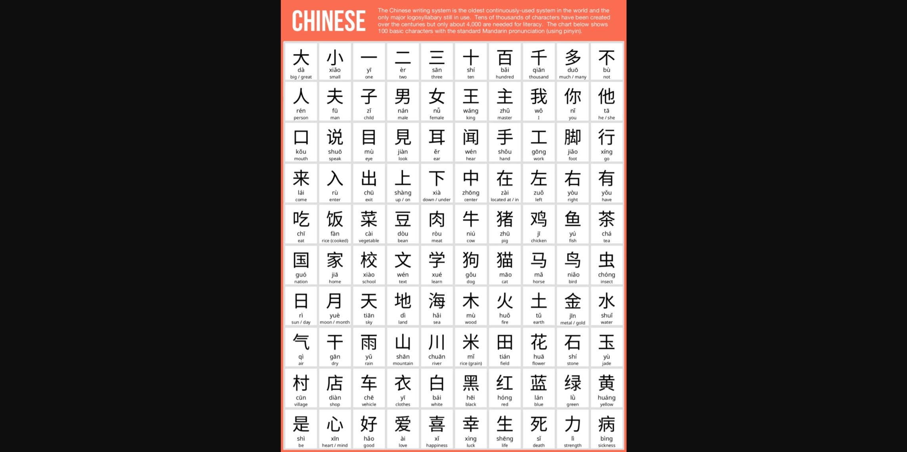
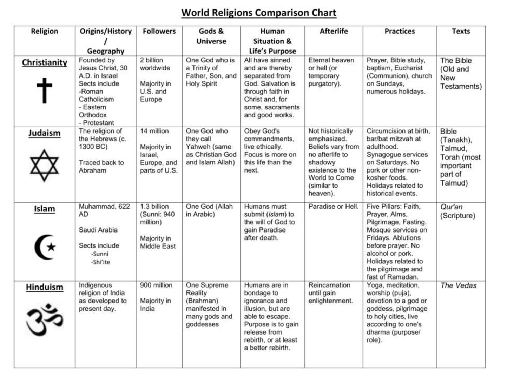

# Religionen — Weltüberblick

**Datum:** 2024-11-29
**Quelle:** Logseq

---

## Christentum

Das Christentum ist eine monotheistische Religion, die auf den Lehren und dem Leben von Jesus Christus basiert. Es ist die weltweit größte Religion mit rund 2,3 Milliarden Anhängern und hat ihre Ursprünge im 1. Jahrhundert n. Chr. im Nahen Osten.

**Zentraler Glaube:** Glaube an einen einzigen Gott (Monotheismus), der sich in drei Personen offenbart: Vater, Sohn (Jesus Christus) und Heiliger Geist (Dreifaltigkeit).

**Heilige Schrift:** Die Bibel — Altes Testament (gemeinsam mit Judentum) + Neues Testament (Leben, Lehren, Tod und Auferstehung Jesu).

**Riten:** Taufe · Eucharistie (Abendmahl) · Gebet · Gottesdienste · Nächstenliebe

**Hauptfeste:** Weihnachten · Ostern · Pfingsten

**Konfessionen:** Katholizismus · Protestantismus · Orthodoxie

**Symbole:** Kreuz · Fisch (Ichthys) · Taube

## Dynasties of Europe

## Bibel — Family Tree of English Translations

## Chinesisch — 100 Basic Chinese Characters

## Greek Gods

## Roman Gods & Emperors

## Hinduismus — Wichtige Gottheiten

## Buddhismus

Der Buddhismus ist eine spirituelle Tradition und Philosophie, die im 5. bis 4. Jahrhundert v. Chr. in Indien entstand. Basiert auf den Lehren von Siddhartha Gautama (Buddha). Ziel: Nirvana — Befreiung vom Leiden.

**Vier Edle Wahrheiten:** Dukkha (Leiden) · Samudaya (Ursache) · Nirodha (Aufhebung) · Magga (Weg)

**Achtfacher Pfad:** Rechte Ansicht · Denken · Rede · Handeln · Lebenserwerb · Bemühung · Achtsamkeit · Konzentration

**Traditionen:** Theravada (Südostasien) · Mahayana (Ostasien) · Vajrayana (Tibet)

**Symbole:** Dharma-Rad · Lotusblume · Stupa

## Weltreligionen — Verteilung

## World Religions Comparison Chart

## Evolution of the Alphabet

---

*Topics: #religionen #geschichte #christentum #buddhismus #mythologie #griechenland #rom*
